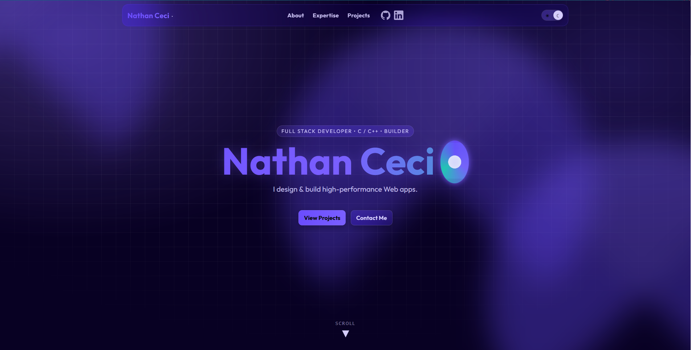

# Nathan Ceci — Portfolio Website

A modern, sleek, and professional portfolio website built with **React** to showcase my projects, expertise, and experience. It highlights my development journey, technical skills, and creative work.

---

## Project Overview 

### Key Features

* **Responsive React Frontend**
  Built with React for speed and scalability, ensuring a seamless browsing experience across devices.

* **Modern & Sleek Design**
  Inspired by cutting-edge crypto websites, featuring gradients, glassmorphism, animations, and a dark/light theme toggle.

* **Projects & Expertise Sections**
  Showcases detailed write-ups of my software projects, game jam entries, and technical skills.

* **Interactive Animations**
  Smooth transitions powered by AOS and Framer Motion for a dynamic browsing experience.

* **Optimized Deployment**
  Hosted with **Vercel**, ensuring fast global delivery and automatic redeployment on push.

---

## Technology Stack 

**Additional Libraries & Tools**

* AOS (Animate on Scroll)
* Framer Motion
* Material UI / Styled Components
* Git & GitHub for version control

---

✨ **[Visit My Portfolio →](https://www.nathanceci.com)** ✨

